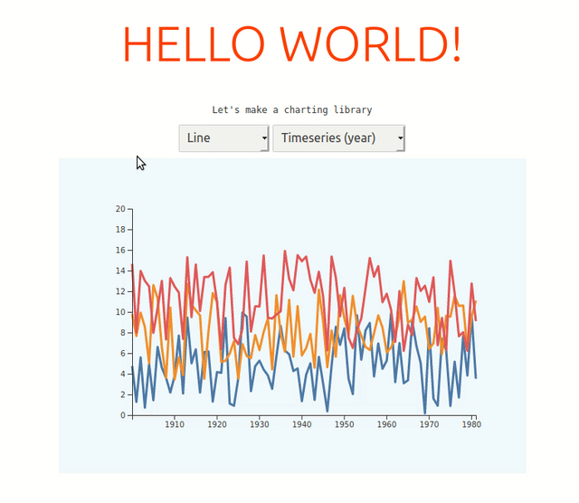

# svelte-charts

**What is this?** A configurable charting component.
**Status** Very alpha

### Usage

Add to your `package.json`:

```
npm install wrgoldstein/svelte-charts --save
```

and to create a chart component:

```svelte
<script>
import { Chart } from "svelte-charts"

let data = {
    labels: [1,2,3],
    datasets: [
        {
            label: 'Series 1',
            data: [5,10,9]
        },
        {
            label: 'Series 2',
            data: [1,3,11]
        },
        
    ]
}
</script>

<Chart {data} {kind}/>
```



